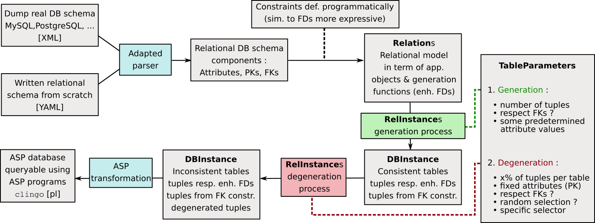

# ASP_DB_generator
From a given relational database schema, instantiate a fresh new ASP database, generating tuples under parametrized constraints

## What is an ASP database?

<i>Anwer Set Programming</i> if a form of declarative programming using the stable model (answer set) semantics of logic pogramming.
An ASP program can be seen as divided in 2 parts :
 * generation of possible candidates (meaning what facts are considered true)   
 * application of constraints to eliminate non matching candidates

This schema maps directly in the usage of queries on a database : the candidates are all database's tuples considered as true facts for the table they're in,
and the query is used to target some tuples on basis of query statement.

More about ASP : [wiki]("https://en.wikipedia.org/wiki/Answer_set_programming") (EN), [course](https://lucas.bourneuf.net/blog/asp-tuto.html) (FR)

We consider the usage of [clingo](https://potassco.org/) for grounding and solving ASP programs.

## Application purposes and features

This application, written in Python 3.7 (full built-in) has been released in the context of research investigations on the <i>Consistent Query Answering</i>
(see [here](https://sigmodrecord.org/publications/sigmodRecord/1909/pdfs/03_Principles_Wijsen.pdf) and [here](https://sigmodrecord.org/publications/sigmodRecord/1603/pdfs/06_Consistent_RH_Koutris.pdf))
problematic. It is used to approach the question in a practical way, as the final goal would ideally be to find solutions about querying actual inconsistent databases.

Although it exists plenty open-access databases to experiment, we don't have control on their content and inconsistency proportions.
The key idea is that, if it is desirable to experiment on actual databases to design queries that make sense, we would like
to have a full control on their content. The taken trade-off is to reuse the relational schemas of actual databases and to regenerate
tables randomly.
 
#### Control your Attributes
As in relational DB theory, we consider tables as Relations and rows as valued tuples from a set of Attributes.
From each Attribute, we are able to pull new generated values of any kind. It can be fully random but also have some sense
in continuity, like a "generator" that returns 0,1,2,3,... on consecutive calls. It allows us to define for example
attributes holding Primary Key properties. As in actual database, an Attribute
has a type associated with, indicating what is generated from. The value generation process is fully customizable,
and it includes the notion of depending on others tuple attributes values (see programmatic constraints).
 
#### Programmatic constraints
The randomness can be limited applying some programmatic constraints on generation process, saying for example
all tuples in a table that have "x_val" as value for attribute <i>x</i> will have "y_val" value for attribute <i>y</i>. This can be more advanced,
as at computing time for *y* value we dispose of *x* value ("x_val"), and so the new calculated value can be any function taking it in parameters.
For instances, Functional Dependencies in Relational DB theory can also be very easily implemented.
This feature allow us to give a meaning to data and write queries relevant to.

#### Constraints between Relations (FKs)
This implementation fully respects the Foreign Keys properties. The thing is that, when Relation *R1* has an attribute *attrFK* that
references Relation *R2* (so PK(*R2*) = *attrFK*), any tuple generated for *R1* must have an occurrence in *R2*.
Of course, only tuple's value for *attrFK* is kept, then a full tuple will be generated in *R2* (valuing others *R2* attributes).
The process is iterative, meaning that if *R2* references also another Relation, this FK constraints will be treated the same way.

#### Degeneration : generate inconsistency
Here is the crucial part for what we study : an inconsistent database has tables where 2 different tuples have the same 
values for the attribute(s) forming the PK. In other words, the PK constraint is not respected ! The process of adding inconsistencies
to a consistent database is named **degeneration**. This is done giving for each table a percentage of degeneration, related
to the number of tuples in the consistent table. This is also customizable to target specific tuples (selector function) and
randomizable. A tuple is degenerated duplicating it on basis of PK attributes, regenerating new different values for
other attributes. Once degenerated tuple is added to the table, the FKs constraints are then respected as in normal adding.

#### Application workflow


## Generate a relational database

### From scratch
It refers to the fact we define the database schema ourselves, programmaticaly or from a file written for this purpose.
Here is an example how to do it writing only Python code, from the file [example1](examples/fromcode/example1_generation.py) :
* Let's define an Attribute that will be the PK of our first Relation (the value generating function is let to default, here an
incrementer (+1) since Attribute's type is *incr_int*)
```python
matricule = AttributeInfo("matricule", attr_type=AttributeTypes.incr_int,
                          desc="Registration number in university system")
```
* Here is another attribute whose generation function is given explicitly 
```python
EXISTING_FACS = ["sciences", "EII", "SHS", "FPSE", "FMM"]
def get_rdm_fac(_):
    return EXISTING_FACS[randint(0, len(EXISTING_FACS)-1)]
fac = AttributeInfo("faculty", attr_type=AttributeTypes.str, get_generator_fun=lambda _: get_rdm_fac,
                    desc="Faculty a univ member is associated with among existing ones (not regarding uni site)")
```
* After defining comprising Attributes, we instantiate the Relation precising its PK
```python
univ = Relation("UnivMembers", attributes=[matricule, persID, fac, role], pk=matricule)
```
* Here is an example of an attribute whose generating process depends on other attributes values (and so has a generation order > 1 that is the implicit value)
```python
def get_label(given_others_attr_values):
    return given_others_attr_values["city"] + '-' + given_others_attr_values["faculty"]
label = AttributeInfo("sitelabel", attr_type='str', get_generator_fun=lambda _: get_label, gen_order=2,
                      desc="Label used as a shortcut designing the site of a faculty")
```
* A second Relation 
```python
faculties = Relation("Faculties", attributes=[fac_in_pk, city, label], pk=[fac_in_pk, city])
```
* Once Relations are instantiated we can impose FKs constraints between them (here *faculty* Attribute from 
UnivMembers Relation references Faculties (one attribute in its composed PK that is *fac_in_pk*))
```python
univ.add_fk_constraint({"faculty": faculties})
```
* Once all defined, we can print the relational schemas of Relations that will compose our database
```
print(univ, faculties, usedsites, sep='\n')
Relation UnivMembers| vvv PK vvv
                    | matricule : matricule [1] (INTEGER_INCR) desc : Registration number in university system
                    | vvv OTHERS vvv
                    | persid : persid [1] (STRING) desc : A personal identifier settable by the member (rdm initially)
                    | faculty : faculty [1] (STRING) desc : Faculty a univ member is associated with among existing ones (not regarding uni site) - FK for Faculties
                    | role : role [2] (STRING) desc : Role of the member in the university (professor/student)

Relation Faculties| vvv PK vvv
                  | faculty : faculty [1] (STRING) desc : An UMONS faculty
                  | city : city [1] (STRING) desc : Place where an UMONS faculty is present
                  | vvv OTHERS vvv
                  | sitelabel : sitelabel [2] (STRING) desc : Label used as a shortcut designing the site of a faculty - FK for UsedSites

Relation UsedSites| vvv PK vvv
                  | sitelabel : shortcut [1] (STRING) desc : Usable shortcut in a scheduling application
                  | vvv OTHERS vvv
```
* When we instantiate the whole database itself, we provide parameters for initial generation phase
Here it's in the simplest form, just the number of tuples to generate in. This example illustrates the iterative
process to respect FKs, as we have a chain of FKs *UnivMembers* → *Faculties* → *UsedSited*.

```python
rel_inst_params = {univ: 5, faculties: 0, usedsites: 0}
db = DBInstance(rel_inst_params)
print(db)
```
```
DBInstance with 3 relation instances, generated from parameters :
>Relation UnivMembers : kept attributes=ALL | respect FK=True | params for generation=5
>Relation Faculties : kept attributes=ALL | respect FK=True | params for generation=0
>Relation UsedSites : kept attributes=ALL | respect FK=True | params for generation=0

Instance of UnivMembers, 5 tuples : 5 (regular) 0 (from constraints) 0 (degenerated)
UnivMembers | C D  [matricule] persid   <faculty> role   
            +--------------------------------------------
            |      1           JQ4SBAP4 sciences  student
            |      2           U5OUYYYX sciences  student
            |      3           8EOBMBNZ SHS       student
            |      4           W9U712J3 SHS       student
            |      5           EAV6GL2V EII       student

Instance of Faculties, 3 tuples : 0 (regular) 3 (from constraints) 0 (degenerated)
Faculties | C D  [faculty] [city] <sitelabel>  
          +------------------------------------
          | *    sciences  Mons   Mons-sciences
          | *    SHS       Mons   Mons-SHS     
          | *    EII       Mons   Mons-EII     

Instance of UsedSites, 3 tuples : 0 (regular) 3 (from constraints) 0 (degenerated)
UsedSites | C D  [sitelabel]  
          +-------------------
          | *    Mons-sciences
          | *    Mons-SHS     
          | *    Mons-EII
```

### From an existing db (MySQL, postgreSQL, ...)
This is currently not implemented, but only requires an adapted parser.
For example, treating the output of ```mysqldump --xml ...``` (see [here](https://www.eversql.com/exporting-mysql-schema-structure-to-xml-using-mysql-clients/#mysqldump)).
## Degenerate a generated database
Detailed in [example2](examples/fromcode/example2_degeneration.py).
Once we have an instantiated database, we can degenerate it based on some parameters. Reusing db defined
previously excepted we fixed *faculty* values for generation to illustrate degeneration takes account of FKs constraints,
 we degenerate 5 tuples in *UnivMembers*
```python
db = DBInstance(rel_inst_params)
degeneration_params = {univ: 5}
db.degenerate_insts(degeneration_params)
print(db)
```
```
DBInstance with 3 relation instances, generated from parameters :
>Relation UnivMembers : kept attributes=ALL | respect FK=True | params for generation=[(5, {'faculty': 'sciences'})]
>Relation Faculties : kept attributes=ALL | respect FK=True | params for generation=0
>Relation UsedSites : kept attributes=ALL | respect FK=True | params for generation=0

Instance of UnivMembers, 10 tuples : 5 (regular) 0 (from constraints) 5 (degenerated)
UnivMembers | C D  [matricule] persid   <faculty> role   
            +--------------------------------------------
            |      1           UN1LYD8L sciences  student
            |      2           MULBWY68 sciences  student
            |      3           FEFKOPOY sciences  student
            |      4           190VCO24 sciences  student
            |      5           19F5H0ZN sciences  student
            |   *  1           71SL4MXW sciences  student
            |   *  2           AIK45LN7 sciences  student
            |   *  3           OO7609ZY sciences  student
            |   *  4           1RK71FD4 EII       student
            |   *  5           BTHXTPQJ SHS       student

Instance of Faculties, 3 tuples : 0 (regular) 3 (from constraints) 0 (degenerated)
Faculties | C D  [faculty] [city] <sitelabel>  
          +------------------------------------
          | *    sciences  Mons   Mons-sciences
          | *    EII       Mons   Mons-EII     
          | *    SHS       Mons   Mons-SHS     

Instance of UsedSites, 3 tuples : 0 (regular) 3 (from constraints) 0 (degenerated)
UsedSites | C D  [sitelabel]  
          +-------------------
          | *    Mons-sciences
          | *    Mons-EII     
          | *    Mons-SHS
```
The degeneration can be more parametrized, here for 5 random tuples of *UnivMembers* (max) respecting selector
condition (ie value for *role* is the constant "professor"), we degenerate keeping fixed values for attributes
*matricule* and *persid*. 
```python
degeneration_params = {univ: (5, True, lambda t: t[0][3] == "professor", ["matricule", "persid"])}
```
## Wrap (de)generation in a more convenient process 
The (de)generation process is highly parametrizable, but the format of parameters the primitives take is quite raw.
We would like to tell the application "I want n tuples in my db, and x% of degeneration". This is done
using some "wrapper" that will do the translation to raw parameters seamlessly. 
This is illustrated in [example3](examples/fromcode/example3_process.py). The part for relational model creation
remains unchanged, here we have to Relations (titlebasic, namebasics) from which we instantiate the database.
The GlobalParameter indicates that in whole database, we want 10 tuples and 200% of inconsistency,
equally distributed between the tables (so here /2 the global values : 5 tuples/table and 100% inconsistency/table).
```python
globparams = GlobalParameters(10, part_deg=200)
instprocess = InstantiationProcess([titlebasic, namebasics], globparams)
instprocess.instantiate_db()
instprocess.denegerate_db()
```  
This is also possible to precise parameters for each relation instantiation individually, and to use an hybrid of both :
GlobalParameter will apply on relations for which specific parameters are not provided. 
```python
titleparams = TableParameters(10, part_deg=100)
nameparams = TableParameters(10, part_deg=100)
instprocess = InstantiationProcess([(titlebasic, titleparams), (namebasics, nameparams)])
```
```python
titleparams = TableParameters(10, part_deg=100)
globparams = GlobalParameters(20, part_deg=200)
instprocess = InstantiationProcess([(titlebasic, titleparams), namebasics], globparams)
```
## Write down a relational database in ASP program
Once the content of the relational database is fixed and we would like to apply ASP queries on it, 
we have to translate it in an ASP compliant format and write it in a file. Be careful that some data
will be transformed to respect ASP clingo syntax, for example constants cannot start with a capital
because it is interpreted as a variable to ground.  
This is done using 
```python
write_db_inst(DBInstance(rel_big_inst_params), asp=True, printed=False, target_dir="../../outputs")
``` 
A sample of the produced ASP database :
```
univmembers(19,j7plz515,fpse,student).
:
faculties(fpse,mons,mons-fpse).
:
usedsites(mons-fpse).
```